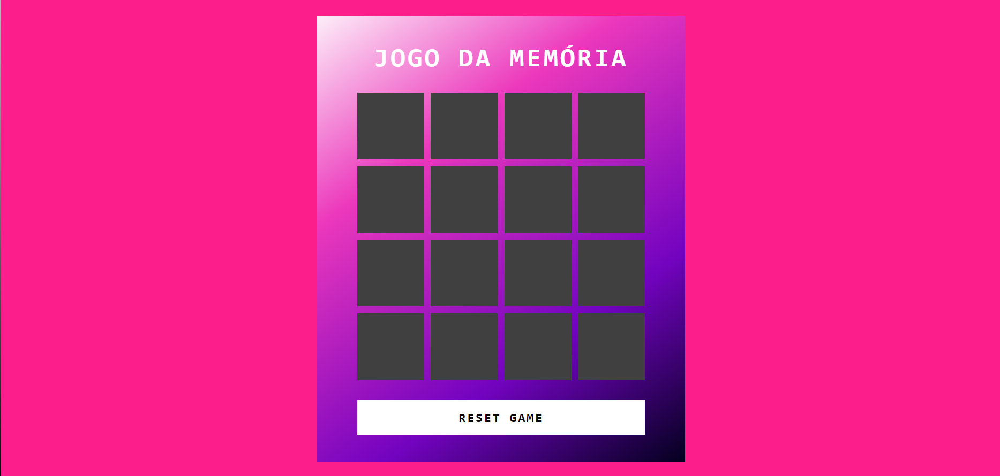
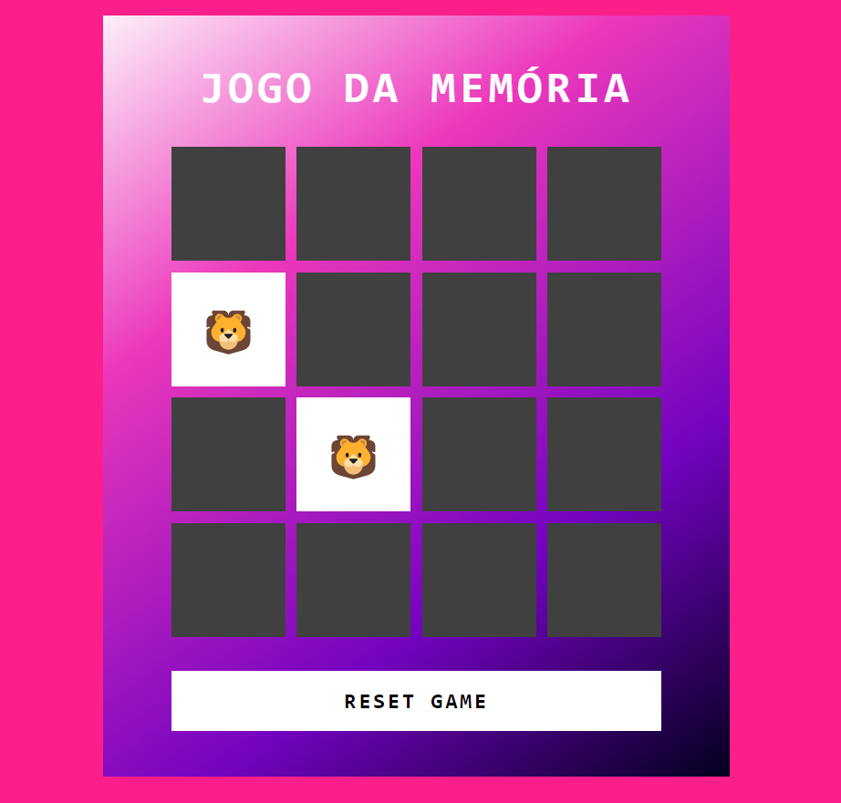
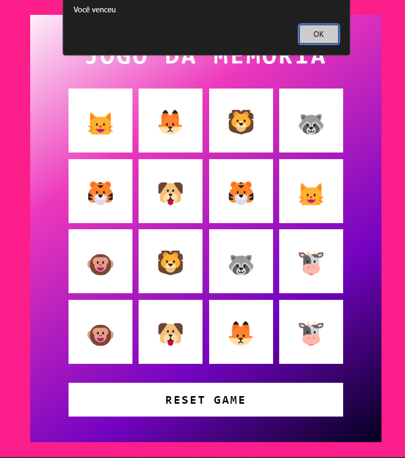

# Jogo-da-memoria
Clique [aqui](https://jclaion.github.io/Memory-Game/) para jogar

## Como funciona?

<h3 align="center"><b>Jogo da memória</b></h3>

O jogo tem como objetivo encontrar os emojis idênticos em cada carta. Ao encontrar duas cartas iguais, elas permanecerão visíveis, indicando progresso.

Você ganha quando encontrar todas as combinações corretamente.

